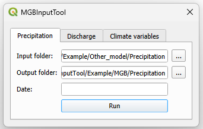
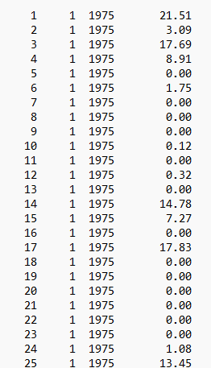

# MGBInputTool

A QGIS plugin designed to streamline the input of hydrological and climatological data into the MGB-IPH model.

## Compatible QGIS Versions
- Version 3.0 or higher.

## Installation

### Steps to Install the Plugin

1. **Download the Plugin**
   - Download the plugin folder in ZIP format from this repository.

2. **Open QGIS**
   - Launch QGIS and navigate to the **"Plugins"** tab.
   - Select **"Manage and Install Plugins".**

3. **Install from ZIP**
   - Click on **"Install from ZIP."**
   - Select the downloaded ZIP file of the plugin.
   - Click **"Install Plugin."**

4. **Verify Installation**
   - After installation, the plugin will be available in the toolbar at the top of the QGIS interface alongside other extensions.
   - If it doesn't appear, go back to **"Manage and Install Plugins"**, open the **"Installed"** tab, and ensure the checkbox next to the plugin is selected.

## Usage
Once installed, the plugin can be used to prepare and manage input data for the MGB-IPH hydrological model, simplifying workflows for hydrological and climatological data processing.

### How to Use

1. **Data Requirements**
   - Precipitation, discharge, and climate data files must have a date column in the format `yyyy-mm-dd`.
   - **Precipitation data files** should include the following columns:
     - `date`
     - `precipitation`
   - **Discharge data files** should include the following columns:
     - `date`
     - `flow`
   - Climate data files should include the following columns:
     - `date`
     - `Temp (°C)`
     - `RelHum (%)`
     - `Wind10m (m/s)`
     - `SunHours (h)`
     - `AtmPres (mb)`
   - The column separator for the files should be a comma `,`.

2. **Using the Plugin**
   - Navigate to one of the three tabs in the plugin interface: **Precipitation**, **Discharge**, or **Climate Variables**.
   - Select the input folder containing `.csv` files for the chosen data type.
   - Example files can be found in the **"Example"** folder.

   

3. **Run the Process**
   - Click **"Run"** to process the files.
   - The output ASCII files will be saved in the selected output folder.

   

*Note: The `date` field allows adjusting the initial date of the data, which is useful when the hydrological model has a date limit for inserting future data.*
